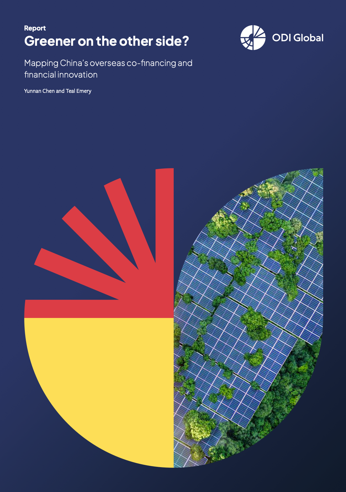

```{r setup, include=FALSE}
knitr::opts_chunk$set(echo = TRUE)
```

# Greener on the Other Side? Mapping China's Overseas Co-financing and Financial Innovation

Welcome! This repository accompanies our research paper, ["Greener on the Other Side? Mapping China's Overseas Co-financing and Financial Innovation,"](https://odi.org/en/publications/greener-on-the-other-side-mapping-chinas-overseas-co-financing-and-financial-innovation/) and includes materials from our Methodological Annex. Our work makes three main methodological contributions:

1. **Demonstrating the promise of LLMs for policy research**: We show how large language models can dramatically reduce the time and cost of policy-relevant classification tasks (processing 18,000 projects in 15 hours for $1.58 instead of 1,500 hours and $22,500), while developing practical validation workflows to ensure trustworthy results.

2. **Raising the bar on reproducibility**: We provide fully transparent code, methods, and assumptions for analyzing Chinese overseas lending—a politically sensitive topic where transparency is particularly valuable—empowering others to scrutinize, challenge, or build upon our findings.

3. **Advancing network analysis of financing relationships**: Building on pioneering work by Joosse et al. (2025) and Escobar et al. (2025), we use social network analysis to map co-financing ecosystems and identify distinct patterns in green vs. non-green investment networks.

This was a modest, exploratory effort with limited time and resources. While we spent considerable time iterating on our approach, it was a lot of work but also a lot of fun. We believe we've made some important contributions, but we acknowledge that this is just the beginning of the journey. Our methodological approaches for policy-relevant LLM-powered classification and network mapping show promise, and we're excited to share them. Our hope is that by making our methods, data workflows, and code available, others can build upon this foundation and advance the research further.

[](https://odi.org/en/publications/greener-on-the-other-side-mapping-chinas-overseas-co-financing-and-financial-innovation/)

## Key Takeaways from Our Methodology

For a detailed discussion, we suggest reading our [Methodological Annex](https://media.odi.org/documents/Methodological_Annex.pdf). A few key takeaways:

1. **Using LLMs for Text Classification: Opening New Frontiers for Policy Research**
   - We leveraged four different LLMs to classify nearly 18,000 project descriptions into "green," "brown," "grey," and "neutral" categories in just 15 hours at a cost of $1.58—a task that would have required approximately 1,500 hours of human labor and $22,500 using traditional approaches (17,957 x 5 minutes per observation x $15 per hour).
   - This efficiency opens exciting new frontiers for policy research, but we recognize that speed and scale must be balanced with accuracy. Just because you can process massive amounts of data cheaply doesn't mean you can trust the results—LLMs can hallucinate.
   - With no established best practices for validation yet, we developed a practical approach: comparing multiple models against human evaluations on a 300-project sample. Our chosen model achieved 91.8% agreement with human raters.
   - We're confident that both the practices and tooling will improve over time, but we hope our practical example provides a useful starting point for others applying LLMs to policy-relevant classification tasks.
2.  **Social Network Analysis (SNA) of Co-financing Relationships**
    -   We created a transaction-level dataset of co-financed lending, identified unique transactions, and mapped them as nodes and edges to see which lenders tend to collaborate.
    -   Our approach reveals structural patterns: which banks or institutions serve as "bridges," how "green" financing networks differ from overall networks, etc.
    -   Insights from SNA can highlight potential ways to encourage collaborative, green finance.
3.  **Pragmatic Approach to Reproducibility**
    -   We used GitHub for version control and renv (in R) for package management, so you can see exactly which versions of each package we used.
    -   Reproducibility is a ladder. We've taken a few steps—version control, documented code, pinned packages—but we acknowledge there's room for improvement, like containerization or fully scripted data extractions, which we could not fully implement due to time and budget limits.
    -   We encourage anyone interested in replicating or extending this analysis to reach out, ask questions, and submit pull requests or issues.
4.  **Policy Relevance & Transparency**
    -   Research on Chinese overseas lending can be politically sensitive, so we aim for transparent methods and assumptions.
    -   Our classification rules (e.g., what counts as "green" vs. "grey" or "brown") may not be universal. Different scholars might define "green" differently. We encourage adaptation and testing alternative definitions in our code.

## Repository Overview

Below is a quick map of key folders and files:

```         
├── R
│   ├── defining_transactions
│   │   └── transaction_definition_exploration.qmd
│   ├── key_figures_and_charts
│   │   ├── charts_and_figures.qmd
│   │   └── social_network_analysis.R
│   ├── llm_classification
│   │   ├── classification-prompt.md
│   │   ├── llm_functions.R
│   │   ├── llm_run_full_dataset.qmd
│   │   └── llm_validation.qmd
│   ├── llm_validation_testing
│   │   └── llm_validation_testing.qmd
│   └── name_standardization
│       ├── funder_name_standardization.qmd
│       └── name_standardization_functions.R
└── renv
    ├── activate.R
    ├── settings.json
    └── ...
```

### 1. LLM Scripts

-   Path: `R/llm_classification/`
-   Key Files:
    -   `classification-prompt.md` – The prompt template we used with each LLM.
    -   `llm_run_full_dataset.qmd` – Runs classification across the full dataset.
    -   `llm_validation.qmd` – Contains code for our sample validation approach, including how we tested four different models and compared their outputs.

Use these to replicate or refine the LLM approach. For those interested in re-running the classification, you'll need API keys or local model setups. Check the code comments for more details.

### 2. Social Network Analysis (SNA)

-   Path: `R/key_figures_and_charts/social_network_analysis.R`
-   We define how we constructed the co-financing network (nodes = lenders, edges = number of co-financed transactions).
-   Steps to replicate:
    1.  Ensure you have the merged dataset with standardized names.
    2.  Run the code to create network objects using tidygraph or igraph.
    3.  Generate the figures in charts_and_figures.qmd or by sourcing the script directly.

### 3. Name Standardization

-   Path: `R/name_standardization/`
-   Key Files:
    -   `funder_name_standardization.qmd` – Our manual or semi-automated approach to unifying variations of lender names.
    -   `name_standardization_functions.R` – Helper functions for fuzzy matching and pattern replacement.

We suggest you review this before working with our data. Spelling inconsistencies or alternative naming conventions can create major headaches in linking transactions together.

### 4. Reproducing Key Figures from the Paper

-   Path: `R/key_figures_and_charts/charts_and_figures.qmd`
-   Contains R code that runs all the data wrangling and plotting steps for the main visuals in our paper.
-   To replicate:
    1.  Install or activate our renv environment.
    2.  Run charts_and_figures.qmd end to end (e.g., in RStudio's "Render" or from the command line).
    3.  Outputs will appear in the output/figures/ directory.

## Installation & Setup

1.  Clone this repository

``` bash
git clone https://github.com/YourOrg/YourRepoName.git
```

2.  Activate the R environment

    -   Make sure you have the renv package installed.
    -   In R, run:

    ``` r
    renv::activate()
    renv::restore()
    ```

    This will install the required package versions.

3.  Check for data availability

    -   Some data files may be too large to store in the repo. Look for references to external data links, or contact us if you need further guidance.

4.  Run analyses

    -   Most .qmd or .R scripts contain a "Setup" section that loads libraries and data.
    -   Adjust file paths if needed.

## Limitations & Future Directions

-   We spent considerable time on this project despite a modest budget and a lot of labor intensity. This means we didn't have the resources to build fully containerized or cross-platform reproducibility solutions. We hope that what we've done—version control, pinned packages, and open-sourcing everything—still moves the needle on reproducible research.
-   Classifying "green" vs. "grey" vs. "brown" projects is inherently subjective and reliant on the text we had. Other researchers might define or interpret "green" differently (e.g., whether nuclear or large-hydro counts). We try to make our assumptions explicit so you can adapt the definitions.
-   LLM-based classification is still experimental—and these models can "hallucinate." We tested models against a \~300-observation sample and cross-checked them with human coders. Use caution and replicate our checks if you plan to rely on these outputs.

## Contact & Feedback

-   If you have questions or feedback, feel free to open an Issue or reach out on LinkedIn. We welcome comments, suggestions, and even pull requests if you spot areas for improvement.
-   Chinese overseas lending is politically sensitive, and all analyses inevitably rely on assumptions and methods with some degree of arbitrariness. By making our code and methodology fully transparent, we aim to raise the bar on reproducibility in this field. This transparency not only makes our analysis more credible by exposing it to scrutiny, but also empowers others to challenge or build upon our work with data-driven approaches rather than just rhetoric. Additionally, by sharing labor-intensive components like name standardization, we hope to prevent others from having to reinvent the wheel.

------------------------------------------------------------------------

Thank you for your interest. We hope you find this repository helpful for exploring new frontiers of applying large language models and social network analysis to policy-relevant challenges, and we look forward to seeing how you might build on our work.

Please cite this work if it helps you in your own research:

> Chen, Yunnan, and Teal Emery. 2025. “Greener on the Other Side? Mapping China’s Overseas Co-Financing and Financial Innovation.” https://odi.org/en/publications/greener-on-the-other-side-mapping-chinas-overseas-co-financing-and-financial-innovation/.

Good luck, and don't hesitate to reach out with any questions!

------------------------------------------------------------------------

Last updated: `r Sys.Date()`
